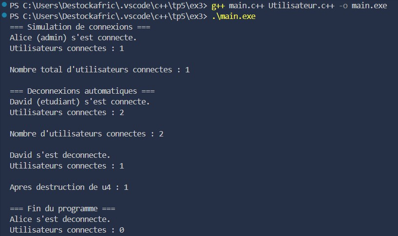
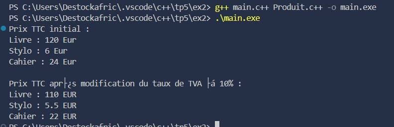

# TP C++ – Attributs et méthodes statiques

## Description
Ce projet contient trois exercices pratiques pour travailler avec les **attributs et méthodes statiques** en C++ :  

1. Compteur d’objets  
2. Taux de TVA partagé  
3. Gestion des sessions utilisateurs  

Chaque exercice illustre l’utilisation des membres statiques pour gérer un **état global partagé** entre toutes les instances d’une classe.

---

## Exercice 1 : Compteur d’objets

**Objectif :**  
Compter le nombre d’objets créés à partir d'une classe.

**Énoncé :**  
- Créer une classe représentant une boîte avec longueur, largeur et hauteur.  
- Ajouter un attribut statique pour compter le nombre d’objets créés.  
- Ajouter une méthode statique pour accéder au compteur.  
- Créer plusieurs objets et afficher le nombre total de boîtes créées.

**Fonctionnalités :**  
- Incrémentation automatique du compteur lors de la création d’un objet.  
- Décrémentation automatique du compteur lors de la destruction d’un objet.  
- Affichage du nombre d’objets en temps réel.

**Résultat :**  
  

---

## Exercice 2 : Taux de TVA partagé

**Objectif :**  
Appliquer un taux commun à plusieurs objets.

**Énoncé :**  
- Créer une classe Produit avec un nom et un prix hors taxe.  
- Ajouter un attribut statique pour le taux de TVA.  
- Ajouter une méthode pour calculer le prix TTC.  
- Ajouter une méthode statique pour modifier le taux de TVA pour tous les produits.  
- Afficher les prix TTC avant et après modification du taux.

**Fonctionnalités :**  
- Gestion centralisée du taux de TVA pour tous les produits.  
- Affichage dynamique des prix TTC avant et après changement du taux.

**Résultat :**  

---

## Exercice 3 : Gestion des sessions utilisateurs

**Objectif :**  
Gérer l’état global d’un système via un attribut statique.

**Énoncé :**  
- Créer une classe Utilisateur avec les attributs `nom` et `role`.  
- Ajouter un attribut statique pour suivre le nombre d’utilisateurs connectés.  
- Incrémenter ce compteur dans le constructeur et le décrémenter dans le destructeur.  
- Ajouter une méthode statique pour accéder au nombre d’utilisateurs connectés à tout moment.  
- Simuler la connexion et la déconnexion de plusieurs utilisateurs dans le programme principal.

**Fonctionnalités :**  
- Suivi en temps réel du nombre d’utilisateurs connectés.  
- Déconnexions automatiques via le destructeur.  
- Méthode statique pour consultation instantanée du compteur.

**Résultat :**  

---

## Technologies utilisées
- C++  
- Compilateur g++ / MinGW  
- VS Code  

---

## Conclusion
Ces exercices permettent de :  
- Maîtriser l’utilisation des **attributs et méthodes statiques** pour gérer un état global.  
- Différencier **attributs d’instance** et **attributs de classe**.  
- Appliquer ces notions dans des scénarios concrets : comptage d’objets, gestion de taxes, suivi des utilisateurs.  
- Concevoir un code plus réutilisable et maintenable.
